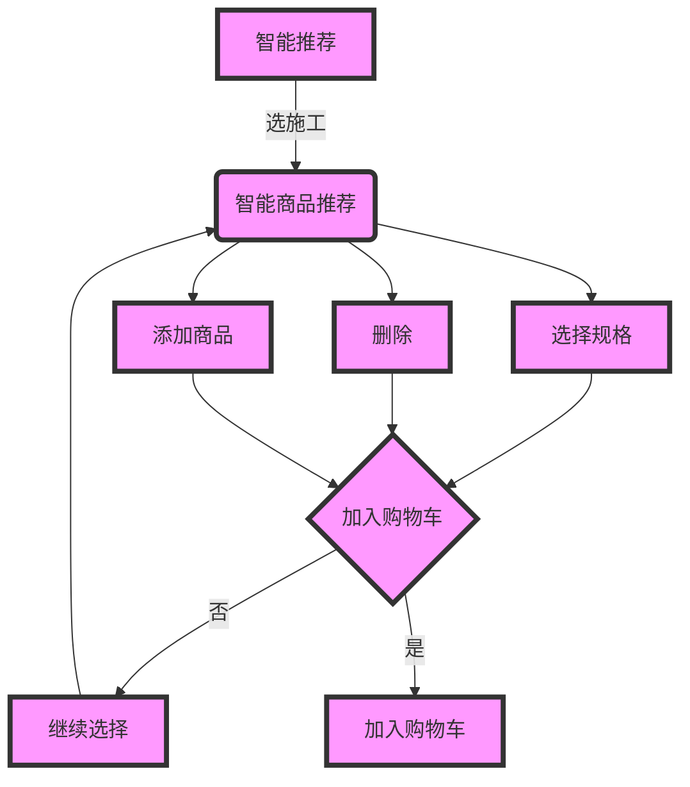

# APP 2.0 开发接口文档




## ZN000  智能推荐入口    7h
## ZN001  智能分类查询    20h+16h
- requst
````
{
  "queryType":101 //水101，电102 .. 累加。。。
  //公共请求参数 cityCode 城市区分
}
````
- response
````
[{
  "navCode":"",
  "navName":"",
  "productInfo":[
    {
      "productPic":"",
      "productName":"",
      "isSelectSku":0, //0否
      "spuName":"",
      "skuType":"",
      "buyQty":2,
      "displayPrice":2.23,
      "noDisplayPrice":2.31,
      "services":"",
      "productCode":"",
      "spuHsid":2311,
      "selSpeList":{

      }
    }
  ]
}]
````

## ZN002 删除请求，虚拟请求
- requst
````
{
  "spuHsid":"" ,
  "productCode":"" //商品编号
}
````

## ZN003 智能商品列表  8h+16h
- requst

````
  {
    "navCode":"",
    //公共请求参数 cityCode 城市区分
  }
````
- response
````
{
  [
    {
      "productPic":"",
      "productName":"",
      "isSelectSku":0, //0否
      "spuName":"",
      "skuType":"",
      "buyQty":2,
      "displayPrice":2.23,
      "noDisplayPrice":2.31,
      "services":"",
      "productCode":"",
      "spuHsid":"",
      "selSpeList":{

      }
    }
  ]
}
````


## ZN004 返回，虚拟请求
- requst
````
{
  "requestType":10001 //水类的返回  。。。。
}
````

## ZN005 加入购物车，虚拟请求
- requst
````
{
  
}
````


## ZN006 继续购物，虚拟请求
- requst
````
{
}
````

## S2002 添加购物车
- 批量添加，单个用S1401
- requst

````
  [
    {
    //公共请求参数 cityCode 城市区分
      "productCode":"",
      "buyQty":"",
      "spuName","",
      "services":"",
    }
  ]
````


## S2001 添加购物车  24h+16h
- 批量添加，单个用S1401
- requst

````
  [
    {
    //公共请求参数 cityCode 城市区分
      "productCode":"",
      "buyQty":"",
      "spuName","",
      "services":"",
    }
  ]
````

## token   40h+40h

# 首页
## app/data/api/index
### transcode
|旧transcode|新transcode|功能|简写全拼|
|:--:|:--:|:--:|:--:|
|HP504|IP001|轮播广告|IndexPlayer|
|HP503|IN001|首页导航|IndexNavi|
|HP505|IF001|爆款|IndexFad|
|PL505|IS001|搜索（共用）|IndexSearch|
|PL106|IPD01|广告进入商品详情（共用）|IndexPlayerDetail|
|PL705|INL01|首页导航点击列表（共用）|IndexNaviList|
||II001|智能购买入口点击|IndexIntelligent|
|PL106|IFD01|首页爆款进入商品详情（共用）|IndexFadDetail|

# 分类导航
## app/data/api/navigation
### transcode
|旧transcode|新transcode|功能|简写全拼|
|:--:|:--:|:--:|:--:|
|PL505|NS001|搜索（共用）|NaviSearch|
|PL705|NL001|请求对应列表（共用）|NaviList|
|PL106|ND001|列表进入商品详情（共用）|NaviDetail|
|PL507|NA001|点击加入购物车按钮（共用）|NaviAddCart|

# 智能下单
## app/data/api/intelligent
### transcode
|旧transcode|新transcode|功能|简写全拼|
|:--:|:--:|:--:|:--:|
||ZN000|智能推荐入口||
||ZN001|智能分类查询||
||ZN002|删除请求，虚拟请求||
||ZN003|智能商品列表||
||ZN004|返回，虚拟请求||
||ZN005|加入购物车，虚拟请求||
||ZN006|继续购物，虚拟请求||
||S2002|去购物车，虚拟请求||
||S2001|点击加入购物车按钮（批量）||
